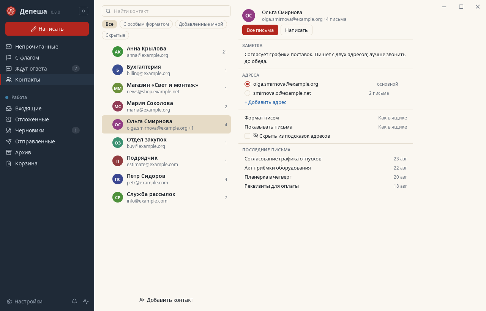
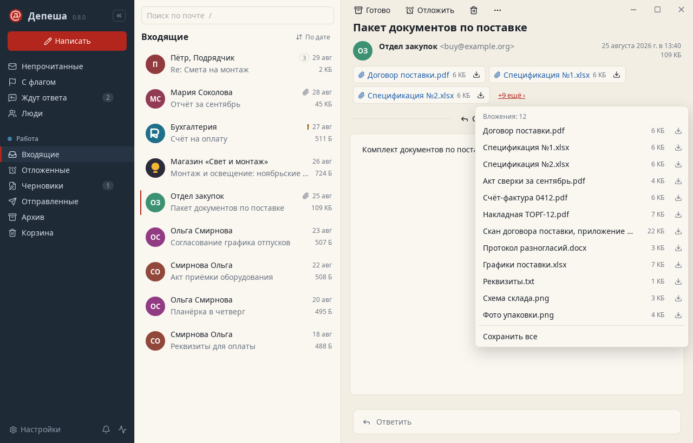
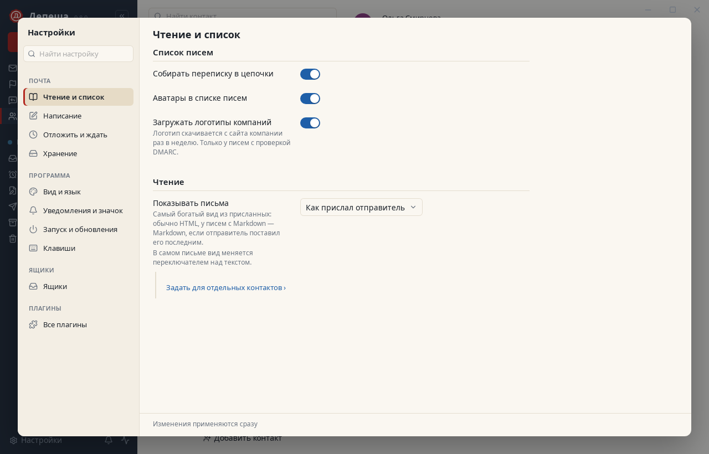
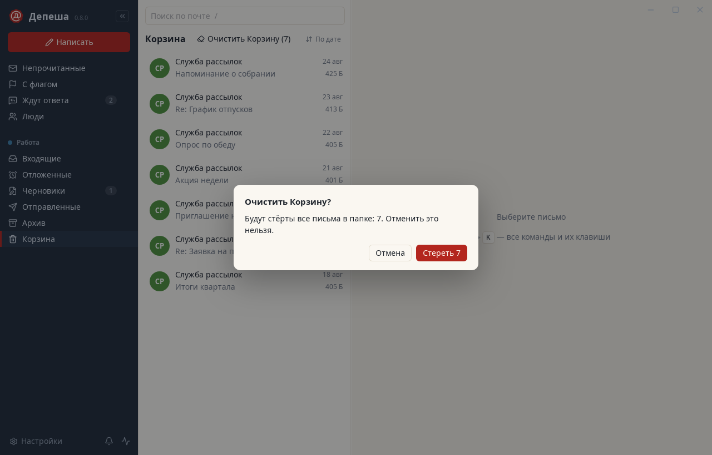
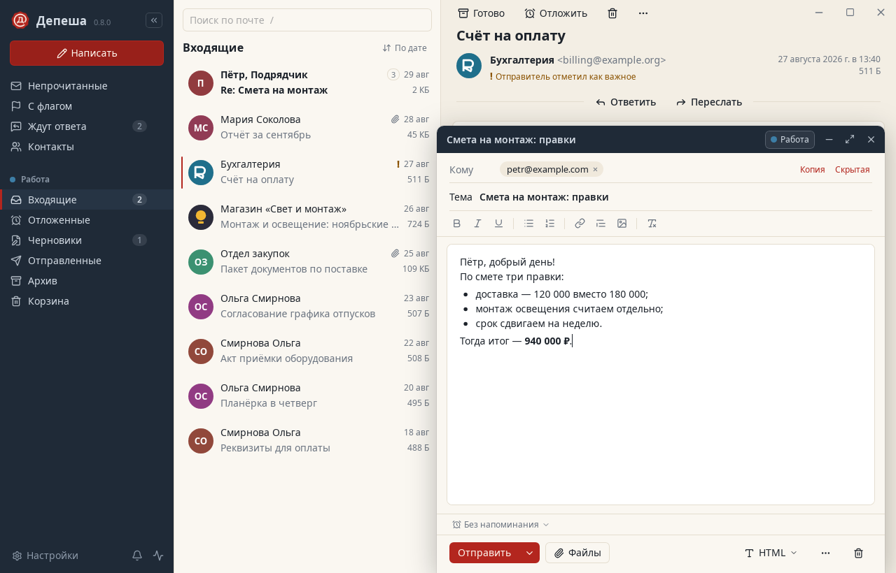
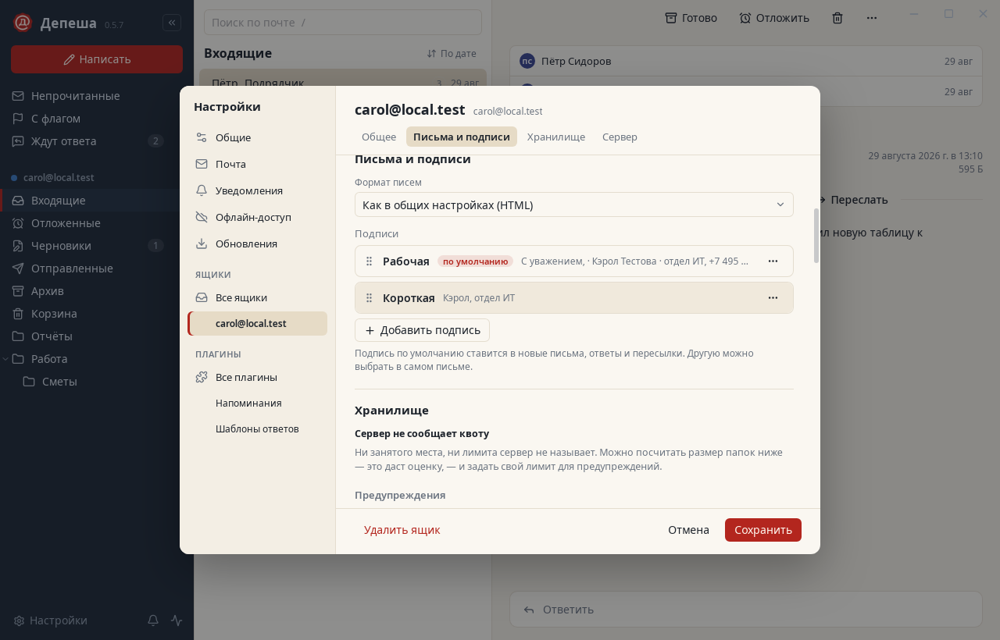
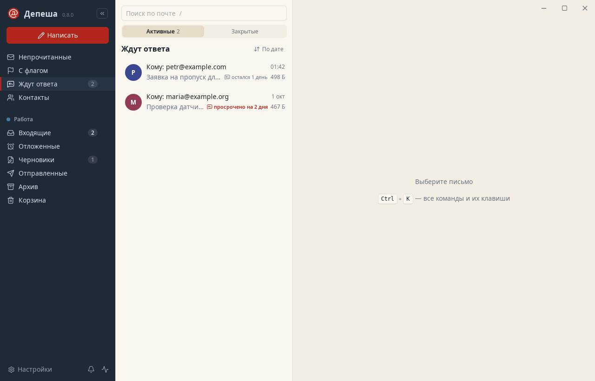
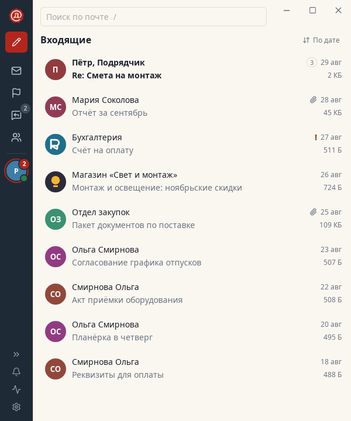
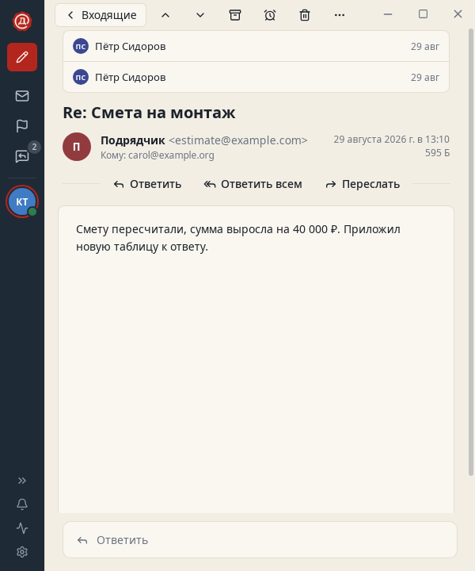

<p align="center"></p>

<h1 align="center">Депеша</h1>

<p align="center">Быстрый почтовый клиент для компьютера. Работает с любым IMAP/SMTP-сервером — от Gmail до корпоративного Exchange 2019.<br>Rust · Tauri 2 · Svelte 5. <a href="README.en.md">English</a>.</p>

<p align="center"></p>

## Зачем ещё один клиент

Чтобы просто читать почту через свой веб-интерфейс, нужно держать PHP, базу данных и веб-сервер. Привычные почтовые программы либо тянут за собой груз двадцатилетней давности, либо по умолчанию считают, что у вас Gmail. Депеша — одна программа без лишних зависимостей. Ей достаточно IMAP и SMTP, и с корпоративным Exchange она уживается без сюрпризов: понимает русские названия папок, прячет календари и контакты, соблюдает лимиты на отправку, доверяет внутренним сертификатам.

## Что умеет

Всё построено на том, как с почтой работают на самом деле. Откуда взялись решения — в [docs/ux.md](docs/ux.md).

- **Входящие как список дел.** `e` — письмо готово и уходит в архив, `h` — отложить, `#` — удалить, `!` — в спам. Следующее письмо открывается само. Любое действие можно отменить клавишей `z` или кнопкой «Отменить» во всплывающем сообщении.
- **Вернуться к письму позже.** Отложите его до вечера, до утра, до понедельника или на любое время. Пока оно ждёт, оно лежит в обычной папке на сервере (её видно и в OWA), а в срок вернётся во входящие непрочитанным.
- **Не забыть про ответ.** При отправке можно попросить напомнить, если вам не ответят. Такие письма собраны в разделе «Ждут ответа»; как только ответ придёт, напоминание исчезнет само.
- **Отправить и не пожалеть.** Десять секунд, чтобы передумать. Можно отправить письмо по расписанию. Перед отправкой Депеша проверит: не забыли ли вложение, о котором пишете, нет ли среди коллег случайного внешнего адреса, не слишком ли много получателей, есть ли тема.
- **Переписка целиком.** Вся цепочка — одна строка в списке. Откройте её — и увидите все письма разговора, свои ответы тоже.
- **Сначала люди.** Рассылки и уведомления роботов Депеша узнаёт по заголовкам и показывает отдельно. Отписаться можно в один клик (RFC 8058), письмом или на странице отправителя. Оповещения приходят только о письмах от контактов, а на время работы их можно выключить совсем.
- **Свой порядок.** Меню «Вид» над списком: сначала новые, важное наверху (непрочитанные, письма людей, с флагом), по отправителю, по теме, крупные сначала — или свои ключи один за другим. У каждого списка может быть свой порядок и свой выбор «Люди / Рассылки». Только что прочитанное письмо остаётся на месте, пока вы не ушли из списка.
- **Найти любое письмо.** Полнотекстовый поиск, который понимает русский язык, и уточнения `от:` `кому:` `тема:` `есть:вложение` `is:unread` `до:` `после:` `в:`, а для крупных писем `больше:25М` `старше:1г` `год:2024` `в:Папка/*` `ящик:`. Старую почту, которой нет на компьютере, Депеша ищет прямо на сервере. Все письма от одного человека — одним щелчком. Крупные письма — готовыми запросами в подсказках поиска и в Ctrl+K, с количеством и суммарным размером найденного.
- **Всё с клавиатуры.** `Ctrl+K` открывает палитру команд: наберите пару букв — и выполните любое действие или перейдите в любую папку.
- **Любой сервер.** Несколько ящиков и общие входящие. Настройки сервера Депеша находит сама. Новая почта приходит сразу (IMAP IDLE), а после обрыва связи или сна ноутбука соединение восстанавливается. Учтены особенности Exchange: русские названия папок, скрытые календари и контакты, лимит в пять писем в минуту.
- **Вход через Google, Яндекс и Microsoft.** OAuth 2.0 в системном браузере (PKCE, ответ на 127.0.0.1); IMAP и SMTP входят по XOAUTH2, токен обновления хранится в связке ключей. OAuth-клиенты вшиваются при сборке из `DEPESHA_GOOGLE_CLIENT_ID`/`_SECRET`, `DEPESHA_YANDEX_CLIENT_ID`/`_SECRET` и `DEPESHA_MICROSOFT_CLIENT_ID`.
- **Exchange, у которого есть только OWA.** Если IMAP и SMTP закрыты, Депеша работает через Exchange Web Services: Autodiscover или адрес OWA, вход по Basic или NTLM (с channel binding для Extended Protection), папки, синхронизация, флаги, перемещение, поиск, отправка с копией в «Отправленных» силами сервера, новая почта через streaming notifications.
- **По-русски и по-английски.** Язык берётся из системы, его можно сменить в настройках — без перезапуска. Переведено всё: меню, ошибки, даты, строка «… пишет:» над цитатой.
- **Повседневное.** Ответ, ответ всем, пересылка с вложениями, письма обычным текстом, с оформлением (HTML с картинками прямо в тексте) или в Markdown, несколько подписей на ящик (в том числе оформленных, с логотипом), шаблоны, подсказка адресов, действия сразу с несколькими письмами, чтение без интернета, светлая и тёмная тема.
- **Узкое окно.** На ноутбуке боковая панель сворачивается в полосу значков с кружками ящиков, а список и письмо показываются по очереди — то же окно остаётся рабочим и на половине экрана. Избранные папки ящика выносятся наверх и остаются под рукой, даже когда ящик свёрнут.
- **Порядок в ящике.** Раздел «Сервер» показывает, что умеет ваш IMAP-сервер и что из этого использует Депеша (IDLE, MOVE, CONDSTORE, QRESYNC, QUOTA и другое), с техническими подробностями для письма в поддержку. Раздел «Хранилище» — сколько места ящик занимает на сервере и на этом компьютере, с предупреждением у порога.
- **Входящие бывают в Markdown.** Если отправитель прислал письмо в Markdown, его можно прочитать как Markdown, HTML или текст; свои письма тоже можно писать в Markdown.
- **Контакты.** Адресная книга в главном окне, рядом с папками. У контакта может быть несколько адресов; дубли Депеша находит сама и предлагает объединить, а объединение можно отменить. «Все письма» контакта показывают письма от него по всем адресам.
- **Аватары и логотипы.** В списке писем слева кружок отправителя: логотип компании, иначе фото, иначе инициалы. Логотипы запрашиваются из сети уже при показе письма в списке; выключить их можно в настройках («Чтение и список» → «Список писем» → «Загружать логотипы компаний»). Поддельное письмо чужого логотипа не получает.
- **Важные письма.** Письма, помеченные отправителем как важные, отмечены в списке значком «!», найти их можно поиском `это:важное`. Свою важность можно поставить и самому.
- **Очистить.** В Корзине, Спаме и Черновиках есть кнопка «Очистить»: диалог называет число писем, пять секунд идёт отсчёт, в который всё ещё можно отменить. Черновики не стираются, а уходят в Корзину.
- **Печать.** Открытое письмо можно напечатать или сохранить в PDF через системный диалог печати, в том числе на macOS.
- **Настройки по задачам.** Окно настроек разложено на «Почту» и «Программу», изменения сохраняются сразу, последнее можно отменить. Настройки работают слоями: общие, затем ящик, затем контакт.
- **Окно письма.** Служебные полосы не съедают место: поле текста не ниже 160 пикселей, даже когда вложений много. Когда вложений много, они занимают две строки, остальные прячутся за «+N ещё ›».

<p align="center"> </p>
<p align="center"> </p>
<p align="center"> </p>
<p align="center"> </p>
<p align="center"> </p>
<p align="center"> </p>
<p align="center"></p>

## Плагины

Депеша устроена как Obsidian: в основе только то, без чего почты нет, — ящики, синхронизация, список писем, чтение, новое письмо, поиск и исходящие. Остальное из списка выше — отложенные письма, «Ждут ответа», разделение на людей и рассылки, отправка по расписанию, шаблоны, проверка перед отправкой, палитра команд — встроенные плагины. Не нужно — выключите в разделе «Плагины» окна настроек (шестерёнка внизу боковой панели или `Ctrl+,`), и вместе с плагином пропадут его кнопки, клавиши, разделы и проверки.

Свои плагины пишутся на обычном JavaScript. В манифесте плагин заранее перечисляет, что ему нужно: читать письма, раскладывать их по папкам, хранить свои данные, ходить на конкретный сайт. Ничего сверх этого он не получит. Каждый плагин работает в отдельной песочнице, без доступа к самой программе, и запускается только тогда, когда понадобился. Если плагин долго не отвечает, Депеша его останавливает, поэтому даже зависший плагин не подвесит окно.

В репозитории есть три примера: предупреждение о письмах с чужого домена, время чтения письма и правила, которые раскладывают новую почту по папкам. Как написать свой — в [plugins/README.md](plugins/README.md).

## Безопасность

- Пароли хранятся только в системном хранилище ключей и никогда не попадают ни в файлы, ни в журналы.
- Если сервер не принял пароль, ящик встаёт на паузу и не пробует снова, так что опечатка в пароле не заблокирует доменную учётную запись.
- Сертификат сервера сверяется с системным хранилищем. Самоподписанному или внутреннему сертификату Депеша поверит, только если вы сами подтвердите его отпечаток SHA-256, а если сертификат сменится — спросит ещё раз.
- Пароль никогда не уходит по незашифрованному соединению. Работа без TLS включается только вручную и с предупреждением.
- HTML писем очищается и показывается без скриптов. Картинки из интернета и счётчики открытий по умолчанию не загружаются. Прежде чем открыть ссылку, Депеша покажет, куда она ведёт на самом деле. Исполняемые вложения не открываются.

Нашли уязвимость — напишите, как описано в [SECURITY.md](SECURITY.md).

## Установка

Готовые сборки — на странице [Releases](../../releases): `.deb`, `.rpm` и AppImage для Linux, `.msi` для Windows, `.dmg` для macOS. Цифровой подписи у сборок пока нет, поэтому при первом запуске Windows и macOS предупредят о неизвестном издателе. В Linux нужна служба Secret Service — GNOME Keyring, KWallet или KeePassXC; в большинстве окружений она уже работает.

## Обновления

Депеша проверяет новую версию при запуске и потом раз в шесть часов. В настройках можно выбрать: ставить обновления сами (так по умолчанию), только сообщать о них или не проверять вовсе.

- **AppImage и macOS** обновляются в фоне. Новая версия заработает после перезапуска — кнопка для этого появится в боковой панели.
- **Windows** скачивает обновление в фоне и ставит его, когда вы перезапускаете или закрываете программу.
- **deb и rpm** только сообщают о новой версии: для установки нужен пароль администратора, поэтому ставится она по вашей команде.

Каждое обновление подписано при сборке, и Депеша проверяет подпись тем ключом, который зашит в неё саму. Файл без подписи или с изменённым содержимым она откажется ставить, а установленная версия останется как была (оба случая проверяет `scripts/test-update.py`). В версиях до 0.3.0 обновлений нет — 0.3.0 нужно один раз поставить вручную.

## На чём проверено

| Сервер | Как |
| --- | --- |
| Dovecot 2.4 | интеграционные тесты: STARTTLS, MOVE, сервер без MOVE и UIDPLUS, IDLE, поиск на сервере по-русски, папка «Отложенные» |
| GreenMail | интеграционные тесты и сквозной тест интерфейса из 45 шагов — все возможности выше, включая плагины и песочницу |
| Exchange 2019 (поведение) | тестовый SMTP-сервер, который отвечает как Exchange; раскладка папок русского Exchange |
| Exchange 2019 EWS (поведение) | тестовый EWS-сервер с ответами Exchange 2019 (`tests/ews.rs`) |
| Ящик на 50 000 писем | первая синхронизация 0,4 с, повторная 0,2–0,4 с, все заголовки 18 с, страница переписок 80 мс, поиск 4–17 мс |

На живом Exchange 2019 Депеша ещё не проверялась. Если у вас он есть, расскажите в issue, как всё прошло, — это очень поможет.

## Сборка из исходников

```
npm install
npx tauri dev          # разработка
npx tauri build        # пакеты в target/release/bundle/
```

Зависимости для сборки в Linux:

```
sudo apt install libwebkit2gtk-4.1-dev libsoup-3.0-dev libjavascriptcoregtk-4.1-dev librsvg2-dev build-essential
```

## Устройство

- `crates/depesha-core` — ядро без интерфейса. IMAP (`async-imap`); собственный SMTP-клиент (EHLO, STARTTLS, AUTH PLAIN/LOGIN, SIZE, коды ответов Exchange); кэш в SQLite с FTS5; разбор MIME (`mail-parser`); TLS (`rustls`, проверка средствами платформы, закрепление отпечатка); поиск настроек сервера.
- `src-tauri` — приложение. На каждый ящик два IMAP-соединения (операции и IDLE), отправкой занимается задача исходящих.
- `src` — интерфейс на Svelte 5; `src/plugin-api` — договор, который видят плагины, `src/plugin-host` их запускает.
- `plugins` — встроенные плагины, по папке на каждый, и примеры сторонних в `plugins/community`.

## Разработка

```
scripts/check.sh --fast   # rustfmt, clippy, svelte-check, vitest, модульные тесты
scripts/check.sh          # плюс интеграционные тесты на GreenMail/Dovecot и сквозной прогон интерфейса
```

Подробности — в [CONTRIBUTING.md](CONTRIBUTING.md) и [e2e/README.md](e2e/README.md). Требования к релизу — в [docs/acceptance.md](docs/acceptance.md), результаты их проверки — в [docs/acceptance-report.md](docs/acceptance-report.md).

## Лицензия

MIT или Apache-2.0 — на ваш выбор.
