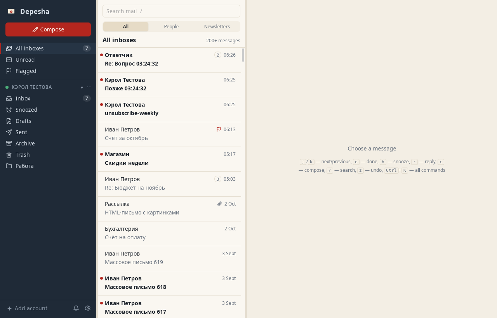
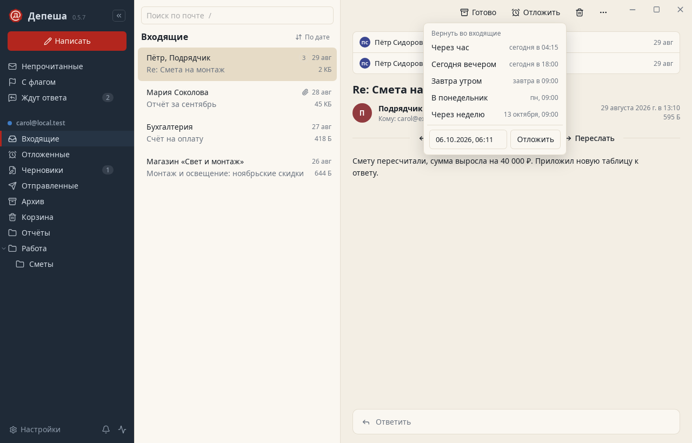
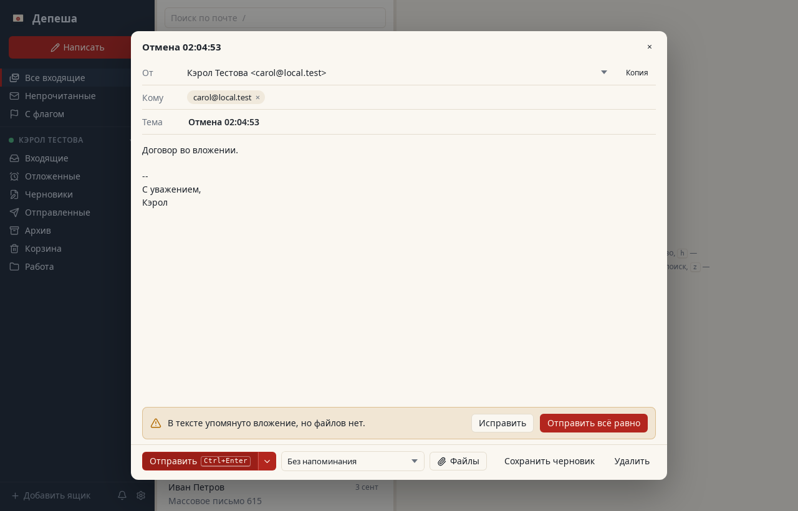
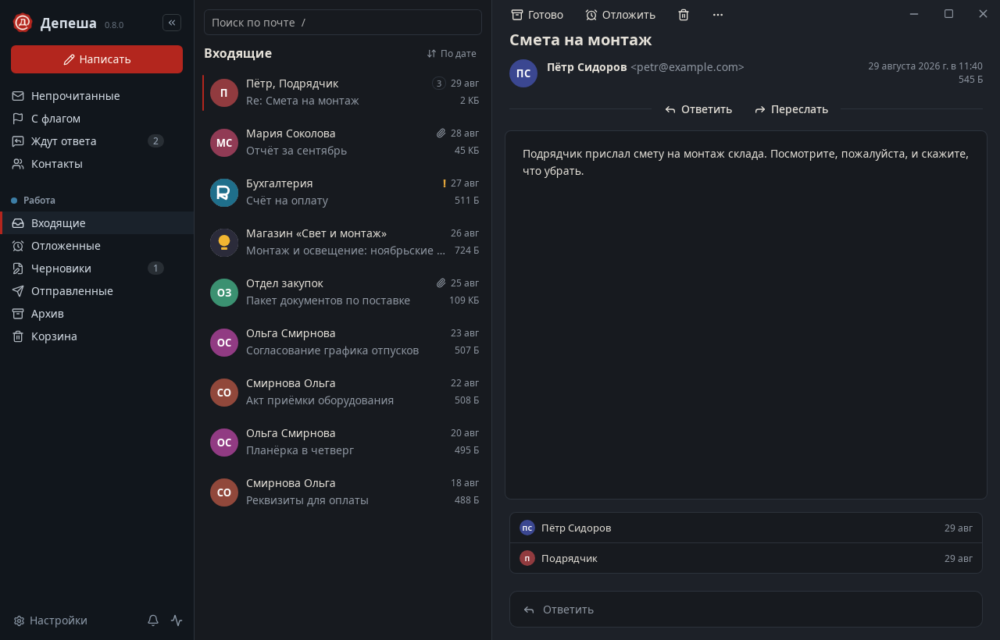
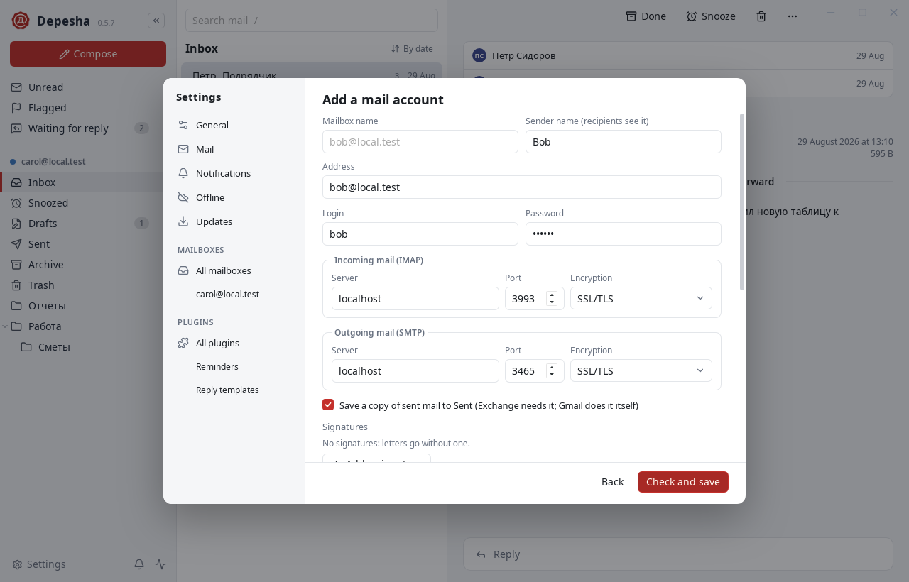

<p align="center"></p>

<h1 align="center">Depesha</h1>

<p align="center">A fast, private desktop mail client for any IMAP/SMTP server — built for Exchange 2019 as much as for Gmail.<br>Rust · Tauri 2 · Svelte 5. <a href="README.ru.md">Читать по-русски</a>.</p>

<p align="center"></p>

> English and Russian. The language follows your system and can be changed in Settings.

## Why

Webmail you have to host (PHP, a database, a web server) is a lot of moving parts for reading mail. Desktop clients either drag decades of baggage or quietly assume Gmail. Depesha is a single native app that speaks plain IMAP and SMTP and behaves well with corporate Exchange: Russian folder names, non-mail folders, rate limits, internal certificates and all.

## Features

Built around what people actually do with mail (see [docs/ux.md](docs/ux.md) for the research and the reasoning):

- **Triage the inbox like a to-do list.** `e` marks a message done and moves it to the archive, `h` snoozes it, `#` deletes, `!` reports spam, and the next message opens by itself. Every move can be taken back with `z` or the toast's "Undo".
- **Come back to it later.** Snooze until tonight, tomorrow morning, Monday or any time. Snoozed mail waits in a real server folder (visible in webmail too) and returns unread when due.
- **Don't lose track of answers.** Ask for a reminder when sending; "Waiting for reply" lists sent mail nobody answered, and the reminder clears itself when the answer arrives.
- **Send without regrets.** Ten seconds to take a message back, scheduled sending, and a check before sending: a mentioned but missing attachment, colleagues and outsiders on one letter, a huge recipient list, no subject.
- **Conversations, not piles.** A thread is one row; open it and see every letter of it, your answers from Sent included.
- **People first.** Newsletters and robots are recognised by their headers (`List-Id`, `List-Unsubscribe`, `Precedence`, `Auto-Submitted`) and shown apart. Unsubscribe in one click (RFC 8058), by mail, or via the sender's page. Notifications come only for mail from people; Do Not Disturb silences everything.
- **Your order.** A "View" menu above the list: newest first, important on top (unread, people, flagged), by sender, by subject or largest first, or keys of your own one after another. Each list may keep its own order and its own People / Newsletters choice. A letter you just read stays where it was until you leave the list.
- **Find anything.** Full-text search that understands Russian, operators (`from:` `to:` `subject:` `has:attachment` `is:unread` `before:` `after:` `in:`, and for large mail `larger:25M` `older:1y` `year:2024` `in:Folder/*` `account:`, with Russian synonyms), ready queries for large mail in the search suggestions and Ctrl+K with the count and total size of what they find, server-side search for mail older than the cache, "all mail from this sender" in one click.
- **Keyboard and command palette.** `Ctrl+K` runs any action or opens any folder by a few letters of its name.
- **Any server.** Multiple accounts and a unified inbox; settings discovery (known providers, autoconfig, MX, SRV); IMAP IDLE with reconnects; Exchange quirks handled: Russian folder names, hidden calendars and contacts, the 5-messages-per-minute limit.
- **Sign in with Google, Yandex or Microsoft.** OAuth 2.0 in the system browser (PKCE, loopback redirect); IMAP and SMTP log in with XOAUTH2, the refresh token stays in the OS keyring. Builds take their OAuth clients from `DEPESHA_GOOGLE_CLIENT_ID`/`_SECRET`, `DEPESHA_YANDEX_CLIENT_ID`/`_SECRET` and `DEPESHA_MICROSOFT_CLIENT_ID`.
- **Exchange with only OWA.** When IMAP and SMTP are closed, Depesha works through Exchange Web Services: Autodiscover or the OWA address, Basic or NTLM login (with channel binding for Extended Protection), folders, sync, flags, moves, search, sending with the copy kept by the server, new mail through streaming notifications.
- **English and Russian.** The interface, error messages, dates and quote headers follow the system language; Settings switch it on the fly.
- **Everyday tools.** Reply, reply all, forward with attachments, letters in plain text, formatted HTML with pictures inline, or Markdown; several signatures per account (styled ones with a logo included), templates, address completion, bulk actions, offline reading, light and dark theme.
- **Narrow windows.** On a laptop the sidebar folds into a strip of icons with account circles and the list and letter take turns — the same window stays usable at half screen. An account's favourite folders sit at the top and stay within reach even when the account is folded.
- **What your mailbox is made of.** The "Server" section shows what your IMAP server can do and what Depesha uses of it (IDLE, MOVE, CONDSTORE, QRESYNC, QUOTA and more), with technical details to paste into a support ticket. "Storage" shows how much room the mailbox takes on the server and on this computer, with a warning near the limit.
- **Markdown in and out.** A letter that arrives in Markdown can be read as Markdown, HTML or plain text, and your own letters can be written in Markdown too.

<p align="center"> </p>
<p align="center"> </p>

## Plugins

Like Obsidian, Depesha keeps the core small: accounts, sync, the list, the reader, compose, search and the outbox. Everything else on the list above — snooze, waiting for reply, people and newsletters, send later, templates, the check before sending, the command palette — is a built-in plugin you can switch off on the **Plugins** page of the settings (`Ctrl+,`); its buttons, keys, sidebar entries and checks go with it.

Community plugins are plain JavaScript with a manifest of permissions (`messages.read`, `messages.modify`, `storage`, `network:<host>`). Each runs in a Web Worker inside a sandboxed frame with no way to the app, starts only when one of its hooks is needed, and is stopped if it does not answer in time, so a broken plugin cannot freeze the window. Examples and the full contract are in [plugins/README.md](plugins/README.md).

## Security

- Passwords live only in the OS keyring (Secret Service, Keychain, Credential Manager). They never touch files or logs.
- After a rejected login the account pauses instead of retrying, so a wrong password cannot lock out an Active Directory account.
- Certificates are verified against the system trust store. A self-signed or internal certificate is accepted only when you explicitly trust its SHA-256 fingerprint, and you are asked again if it changes.
- No password is sent over a connection without TLS. Plaintext connections need an explicit opt-in with a warning.
- Message HTML is sanitized (`ammonia`) and rendered in a script-less sandboxed iframe. Remote images and tracking pixels are blocked by default. Links open only after a confirmation that shows the real address, and executable attachments are never opened.

Found a vulnerability? See [SECURITY.md](SECURITY.md).

## Install

Grab a build from [Releases](../../releases): `.deb`, `.rpm` and AppImage for Linux, `.msi` for Windows, `.dmg` for macOS. Builds are not code-signed yet, so Windows SmartScreen and macOS Gatekeeper will warn on first launch.

On Linux you need a Secret Service provider (GNOME Keyring, KWallet or KeePassXC), which most desktops already run.

## Updates

Like OpenCode's `autoupdate`, Depesha checks for a new version at start and every six hours, with three modes in Settings: install automatically (default), only notify, or never check.

- **AppImage and macOS** install in the background; the new version runs after a restart, offered by a button in the sidebar.
- **Windows** downloads in the background and installs when you restart or quit (the installer closes the app).
- **deb and rpm** only notify: installing needs the administrator password, so it happens on your click.

Every update is signed in the release pipeline, and the app checks the signature against the public key it was built with: an unsigned or modified file is refused and the installed copy stays untouched (`scripts/test-update.py` checks both cases). Versions before 0.3.0 have no updater: install 0.3.0 once by hand.

## Tested against

| Server | How |
| --- | --- |
| Dovecot 2.4 | integration tests: STARTTLS, MOVE, fallbacks without MOVE/UIDPLUS, IDLE, server search with Russian operators, the Snoozed folder |
| GreenMail | integration tests and a 45-step end-to-end GUI run, every feature above included |
| Exchange 2019 (behaviour) | a scripted SMTP server with Exchange replies; Russian Exchange folder layout |
| Exchange 2019 EWS (behaviour) | a scripted EWS server with Exchange 2019 answers (`tests/ews.rs`) |
| 50 000-message mailbox | first sync 0.4 s, re-sync 0.2–0.4 s, full header load 18 s, a page of conversations 80 ms, search 4–17 ms |

Validation against a live Exchange 2019 mailbox is still pending. If you run one, an issue with your results is very welcome.

## Build from source

```
npm install
npx tauri dev          # development
npx tauri build        # packages in target/release/bundle/
```

Linux build dependencies:

```
sudo apt install libwebkit2gtk-4.1-dev libsoup-3.0-dev libjavascriptcoregtk-4.1-dev librsvg2-dev libayatana-appindicator3-dev build-essential
```

## Architecture

- `crates/depesha-core` — the engine, no GUI. IMAP (`async-imap`); its own SMTP client (EHLO, STARTTLS, AUTH PLAIN/LOGIN, SIZE, Exchange status codes); SQLite cache with FTS5; MIME parsing (`mail-parser`); TLS (`rustls`, platform verifier, fingerprint pinning); settings discovery.
- `src-tauri` — the app. Each account runs two IMAP connections (operations and IDLE), and an outbox task sends mail.
- `src` — the Svelte 5 interface; `src/plugin-api` is the contract plugins see, `src/plugin-host` runs them.
- `plugins` — built-in plugins, one folder each, and examples of community plugins in `plugins/community`.

## Development

```
scripts/check.sh --fast   # rustfmt, clippy, svelte-check, vitest, unit tests
scripts/check.sh          # plus GreenMail/Dovecot integration and the GUI end-to-end run
```

See [CONTRIBUTING.md](CONTRIBUTING.md) and [e2e/README.md](e2e/README.md).

## License

Dual-licensed under [MIT](LICENSE-MIT) or [Apache-2.0](LICENSE-APACHE), at your option.
