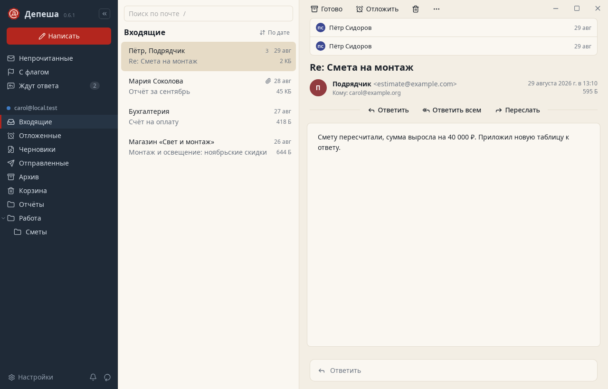

<h1 align="center">Депеша</h1>

Быстрый десктопный почтовый клиент для любого IMAP/SMTP-сервера: и для Exchange 2019, и для Gmail. Rust · Tauri 2 · Svelte 5. <a href="README.md">English</a>.

## Зачем

Самодельный webmail — это PHP, база и веб-сервер ради того, чтобы читать почту. Десктопные клиенты либо тащат за собой десятилетия наследия, либо молча рассчитывают на Gmail. Депеша — одно нативное приложение. Оно говорит на обычном IMAP и SMTP и нормально ведёт себя с корпоративным Exchange: русские имена папок, служебные папки, лимиты отправки, внутренние сертификаты.

## Возможности

Устроена вокруг того, что люди на самом деле делают с почтой; исследования и выбор приёмов — в [docs/ux.md](docs/ux.md).

- **Входящие как список дел.** `e` — «Готово», письмо уходит в архив; `h` — отложить; `#` — удалить; `!` — спам. Следующее письмо открывается само. Любой перенос отменяется клавишей `z` или кнопкой «Отменить».
- **Вернуться позже.** «Отложить» до вечера, до утра, до понедельника или до своего времени. Письмо ждёт в настоящей папке на сервере (её видно и в OWA) и в срок возвращается непрочитанным.
- **Не потерять ответ.** При отправке можно попросить напомнить, если не ответят. Раздел «Ждут ответа» показывает такие письма, а напоминание снимается само, когда ответ пришёл.
- **Отправлять без сожалений.** 10 секунд на отмену отправки, отправка по расписанию и проверка перед отправкой: упомянуто вложение, а файла нет; коллеги и внешние адреса в одном письме; слишком много получателей; нет темы.
- **Переписка, а не куча.** Цепочка — одна строка в списке, а в письме видна вся переписка, включая ваши ответы.
- **Сначала люди.** Рассылки и роботы распознаются по заголовкам и показываются отдельно. Отписка в один клик (RFC 8058), письмом или через страницу отправителя. Уведомления — только о письмах от людей, есть режим «Не беспокоить».
- **Найти что угодно.** Полнотекстовый поиск по-русски, операторы `от:` `кому:` `тема:` `есть:вложение` `is:unread` `до:` `после:` `в:`, поиск на сервере для старой почты, все письма отправителя одним щелчком.
- **Клавиатура и палитра команд.** `Ctrl+K` — любое действие и любая папка по нескольким буквам.
- **Любой сервер.** Несколько ящиков и общий входящий, автоопределение настроек, IMAP IDLE с переподключением, особенности Exchange: русские папки, скрытые календари и контакты, лимит 5 писем в минуту.
- **Повседневное.** Ответ, ответ всем, пересылка с вложениями, подписи, шаблоны, подсказка адресов, групповые действия, чтение без сети, светлая и тёмная тема.

 

 

## Безопасность

- Пароли хранятся только в связке ключей ОС и никогда не попадают в файлы и логи.
- После отказа во входе ящик встаёт на паузу. Неверный пароль не заблокирует доменную учётку повторными попытками.
- Сертификат проверяется по системному хранилищу. Самоподписанному или внутреннему сертификату можно доверять только явно, по SHA-256 отпечатку. Если сертификат сменится, Депеша спросит снова.
- Без TLS пароль не отправляется. Подключение без шифрования включается только явно, с предупреждением.
- HTML писем очищается и показывается в iframe без скриптов. Внешние картинки и трекеры по умолчанию не грузятся. Перед открытием ссылки показывается её настоящий адрес. Исполняемые вложения не открываются.

## Установка

Сборки лежат в [Releases](../../releases): `.deb`, `.rpm` и AppImage для Linux, `.msi` для Windows, `.dmg` для macOS. Сборки пока не подписаны, поэтому SmartScreen и Gatekeeper предупредят при первом запуске. На Linux нужна служба Secret Service (GNOME Keyring, KWallet или KeePassXC).

## Обновления

Как `autoupdate` в OpenCode: Депеша проверяет новую версию при запуске и каждые шесть часов. В настройках три режима: устанавливать автоматически (по умолчанию), только сообщать, не проверять.

- **AppImage и macOS** обновляются в фоне. Новая версия начнёт работать после перезапуска, кнопка появится в боковой панели.
- **Windows** скачивает обновление в фоне и ставит при перезапуске или выходе: установщик закрывает приложение.
- **deb и rpm** только сообщают. Для установки нужен пароль администратора, поэтому она идёт по вашей кнопке.

Каждое обновление подписывается при сборке релиза. Приложение сверяет подпись с открытым ключом, с которым было собрано: неподписанный или изменённый файл отвергается, установленная копия не трогается (`scripts/test-update.py` проверяет оба случая). В версиях до 0.3.0 обновления нет: 0.3.0 нужно один раз поставить вручную.

## Проверено

| Сервер | Как |
| --- | --- |
| Dovecot 2.4 | интеграционные тесты: STARTTLS, MOVE, работа без MOVE и UIDPLUS, IDLE, поиск на сервере с русскими операторами, папка «Отложенные» |
| GreenMail | интеграционные тесты и сквозной тест интерфейса из 39 шагов, включая все функции выше |
| Exchange 2019 (поведение) | сценарный SMTP-сервер с ответами Exchange; раскладка папок русского Exchange |
| Ящик на 50 000 писем | первая синхронизация 0,4 с, повторная 0,2–0,4 с, все заголовки 18 с, страница цепочек 80 мс, поиск 4–17 мс |

Проверка на живом Exchange 2019 ещё впереди. Если у вас он есть, результаты в issue очень пригодятся.

## Сборка, разработка, лицензия

Как собрать и проверить — в [README.md](README.md#build-from-source). Критерии приёмки — [docs/acceptance.md](docs/acceptance.md), результаты — [docs/acceptance-report.md](docs/acceptance-report.md). Лицензия MIT или Apache-2.0 на выбор.
